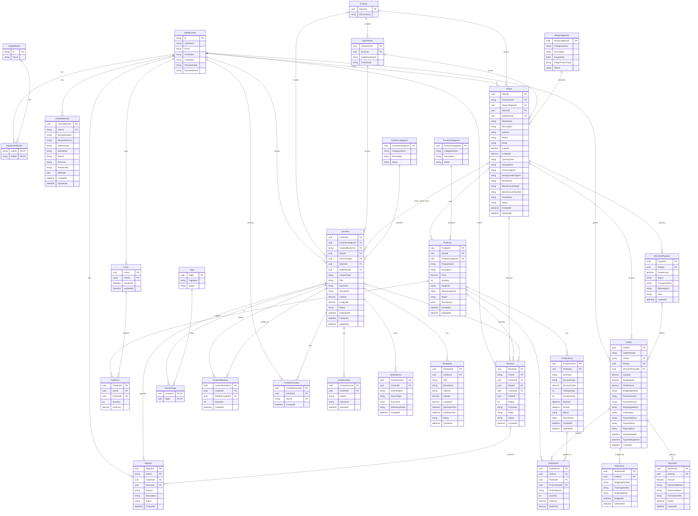

# ER Diagram — KanchanaburiPlatform

สร้างจาก `KanchanaburiPlatform.Infrastructure/Migrations/StoreContextModelSnapshot.cs` (EF Core / SQL Server)

```mermaid
erDiagram
    %% ===== Users & Identity =====
    AspNetUsers {
        string Id PK
        string UserName
        string Email
        string FirstName
        string LastName
        string PhoneNumber
        string PasswordHash
    }
    AspNetRoles {
        string Id PK
        string Name
    }
    AspNetUserRoles {
        string UserId PK,FK
        string RoleId PK,FK
    }
    UserAddresses {
        uuid UserAddressId PK
        string UserId FK
        string RecipientName
        string RecipientPhone
        string AddressLine
        string SubDistrict
        string District
        string Province
        string PostalCode
        bool IsDefault
        datetime CreatedAt
        datetime UpdatedAt
    }

    %% ===== Location =====
    Districts {
        uuid DistrictId PK
        string DistrictName
    }
    SubDistricts {
        uuid SubDistrictId PK
        uuid DistrictId FK
        string SubDistrictName
        string PostalCode
    }

    %% ===== Shop =====
    ShopCategories {
        uuid ShopCategoryId PK
        string CategoryName
        string Description
        bytes ImageData
        string ImageContentType
        string Status
    }
    Shops {
        uuid ShopId PK
        string OwnerUserId FK
        uuid ShopCategoryId FK
        uuid DistrictId FK
        uuid SubDistrictId FK
        string ShopName
        string Description
        string Address
        string Phone
        string Email
        decimal Latitude
        decimal Longitude
        string OpeningTime
        string ClosingTime
        string CoverImageUrl
        string BackgroundImageUrl
        string BankName
        string BankAccountName
        string BankAccountNumber
        string PromptPay
        string Status
        datetime CreatedAt
        datetime UpdatedAt
    }
    MerchantPayouts {
        uuid PayoutId PK
        uuid ShopId FK
        decimal TotalAmount
        string Status
        string TransactionRef
        string SlipImageUrl
        string Note
        datetime CreatedAt
    }

    %% ===== Product =====
    ProductCategories {
        uuid ProductCategoryId PK
        string CategoryName
        string Description
        string Status
    }
    Products {
        uuid ProductId PK
        uuid ShopId FK
        uuid ProductCategoryId FK
        string ProductName
        string Description
        decimal Price
        int Quantity
        string ImageUrl
        string DetailImageUrls
        string Status
        bytes RowVersion
        datetime CreatedAt
        datetime UpdatedAt
    }
    ProductDeal {
        uuid ProductDealId PK
        uuid ProductId FK
        string DealType
        string DiscountType
        decimal DiscountValue
        int TotalQuantity
        int UsedQuantity
        datetime StartsAt
        datetime EndsAt
        string Status
        bytes RowVersion
        datetime CreatedAt
        datetime UpdatedAt
    }

    %% ===== Cart & Order =====
    Carts {
        uuid CartId PK
        string UserId FK
        datetime CreatedAt
        datetime UpdatedAt
    }
    CartItems {
        uuid CartItemId PK
        uuid CartId FK
        uuid ProductId FK
        int Quantity
        decimal UnitPrice
    }
    Orders {
        uuid OrderId PK
        string OrderNumber
        string UserId FK
        uuid ShopId FK
        uuid MerchantPayoutId FK
        decimal Subtotal
        decimal ShippingFee
        decimal TotalAmount
        string ShippingMethod
        string ReceiverName
        string ReceiverPhone
        string ShippingAddress
        string OrderStatus
        string PaymentStatus
        string PayoutStatus
        string SlipImageUrl
        datetime SlipUploadedAt
        datetime PaymentExpiresAt
        datetime CreatedAt
    }
    OrderItems {
        uuid OrderItemId PK
        uuid OrderId FK
        uuid ProductId FK
        uuid ProductDealId FK
        string ProductName
        int Quantity
        decimal UnitPrice
        decimal TotalPrice
    }
    Payments {
        uuid PaymentId PK
        uuid OrderId FK
        decimal Amount
        string PaymentMethod
        string PaymentStatus
        string TransactionRef
        datetime PaidAt
        datetime CreatedAt
    }
    Shipments {
        uuid ShipmentId PK
        uuid OrderId FK
        string ShippingProvider
        string TrackingNumber
        string ShippingStatus
        datetime ShippedAt
        datetime DeliveredAt
    }

    %% ===== Content =====
    ContentCategories {
        uuid ContentCategoryId PK
        string CategoryName
        string Description
        string Status
    }
    Contents {
        uuid ContentId PK
        uuid ContentCategoryId FK
        string CreatedByUserId FK
        uuid ShopId FK
        uuid OwnerShopId FK
        uuid DistrictId FK
        uuid SubDistrictId FK
        string ContentType
        string Title
        string Summary
        string YoutubeUrl
        decimal Latitude
        decimal Longitude
        string Status
        datetime PublishedAt
        datetime CreatedAt
        datetime UpdatedAt
    }
    Tags {
        uuid TagId PK
        string TagName
        string Status
    }
    ContentTags {
        uuid ContentId PK,FK
        uuid TagId PK,FK
    }
    ContentRelations {
        uuid ContentRelationId PK
        uuid ContentId FK
        uuid RelatedContentId FK
        int SortOrder
        datetime CreatedAt
    }
    ContentFavorites {
        uuid ContentFavoriteId PK
        uuid ContentId FK
        string UserId FK
        datetime CreatedAt
    }
    ContentViews {
        uuid ContentViewId PK
        uuid ContentId FK
        string UserId
        string SessionId
        datetime ViewedAt
    }
    DataSources {
        uuid DataSourceId PK
        uuid ContentId FK
        string SourceName
        string SourceType
        string SourceUrl
        string ReferenceDetail
        datetime CreatedAt
    }
    Schedules {
        uuid ScheduleId PK
        uuid ContentId FK
        string Title
        string Description
        string Address
        decimal Latitude
        decimal Longitude
        datetime StartDateTime
        datetime EndDateTime
        string Status
        datetime CreatedAt
    }

    %% ===== Review & Report =====
    Reviews {
        uuid ReviewId PK
        string UserId FK
        uuid ProductId FK
        uuid ShopId FK
        uuid ContentId FK
        uuid OrderId
        int Rating
        string Comment
        string Reply
        string Status
        datetime CreatedAt
    }
    Reports {
        uuid ReportId PK
        string UserId FK
        uuid ContentId FK
        uuid ReviewId FK
        string Reason
        string Description
        string Status
        datetime CreatedAt
    }

    %% ===== Relationships =====
    AspNetUsers ||--o{ AspNetUserRoles : has
    AspNetRoles ||--o{ AspNetUserRoles : has
    AspNetUsers ||--o{ UserAddresses : has
    AspNetUsers ||--o{ Carts : owns
    AspNetUsers ||--o{ Shops : owns
    AspNetUsers ||--o{ Orders : places
    AspNetUsers ||--o{ Contents : creates
    AspNetUsers ||--o{ ContentFavorites : favorites
    AspNetUsers ||--o{ Reviews : writes
    AspNetUsers ||--o{ Reports : files

    Districts ||--o{ SubDistricts : contains
    Districts ||--o{ Shops : locates
    SubDistricts ||--o{ Shops : locates
    Districts |o--o{ Contents : locates
    SubDistricts |o--o{ Contents : locates

    ShopCategories ||--o{ Shops : classifies
    Shops ||--o{ Products : sells
    Shops ||--o{ Orders : receives
    Shops ||--o{ MerchantPayouts : paid_by
    Shops |o--o{ Contents : "shop / owner shop"
    Shops |o--o{ Reviews : reviewed

    ProductCategories ||--o{ Products : classifies
    Products ||--o{ ProductDeal : has
    Products ||--o{ CartItems : in
    Products ||--o{ OrderItems : in
    Products |o--o{ Reviews : reviewed

    Carts ||--o{ CartItems : contains
    Orders ||--o{ OrderItems : contains
    ProductDeal |o--o{ OrderItems : applied_to
    Orders ||--o{ Payments : paid_by
    Orders ||--o{ Shipments : shipped_by
    MerchantPayouts |o--o{ Orders : settles

    ContentCategories ||--o{ Contents : classifies
    Contents ||--o{ ContentTags : tagged
    Tags ||--o{ ContentTags : tags
    Contents ||--o{ ContentRelations : relates
    Contents ||--o{ ContentRelations : related_to
    Contents ||--o{ ContentFavorites : has
    Contents ||--o{ ContentViews : has
    Contents ||--o{ DataSources : cites
    Contents ||--o{ Schedules : has
    Contents |o--o{ Reviews : reviewed
    Contents |o--o{ Reports : reported
    Reviews |o--o{ Reports : reported
```
